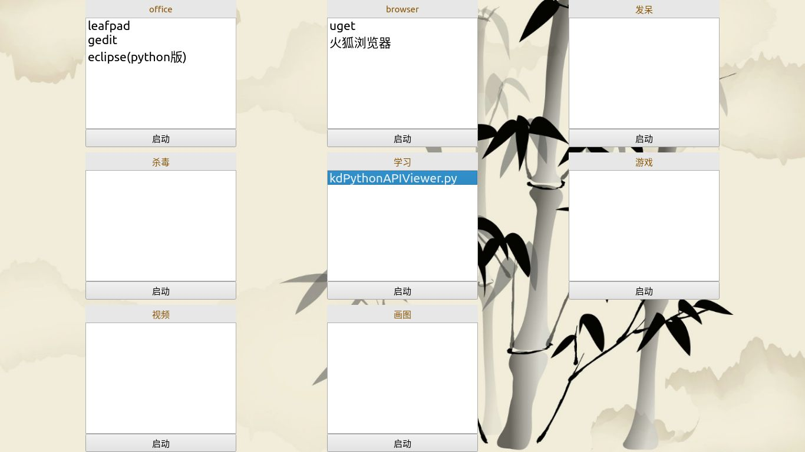

# kdLaunchPad
这是一个会话启动器，一键启动多个程序。

# 起因

我为什么要创建这个程序呢？

每次开机启动的时候，我们都要打开好几个程序或者文件，比如浏览器，QQ，文件管理器。有时候从桌面快捷方式打开，有时候从文件管理器打开，有时候从开始菜单打开。这很浪费时间。

或许我们可以使用系统自带的自动启动功能，但是那个功能太弱了，无法定制话启动方案。比如我上午上班的时候打开工作文档，中午打开音乐播放器听歌。

每次启动系统的时候，我们想让电脑自动打开不同的程序或文件。但系统自带的自动启动功能只能设置一种启动方案。

所以，我创建了这个程序，实现一键打开多个程序或文件的功能，而且开机每次启动的程序或文件可以随便选。

# 截图

# 安装kdLaunchPad
- 安装python和pip，[下载地址](https://www.python.org/downloads/ 下载地址)
- 在终端(比如cmd或者xterm)安装PyQt5。输入命令pip install PyQt5
- 双击kdLaunchPad.py即可运行

# 打包
## 方法一
pyinstaller -F kdLaunchPad.py

最后复制ui文件和image目录到dist目录下即可。

## 方法二

pyinstaller --add-data="kdLaunchPad.ui;." --add-data="launchSession.ui;."  --add-data="sessionItem.ui;." -p="image;."  -c kdLaunchPad.py

最后需要复制image文件夹到dist目录
